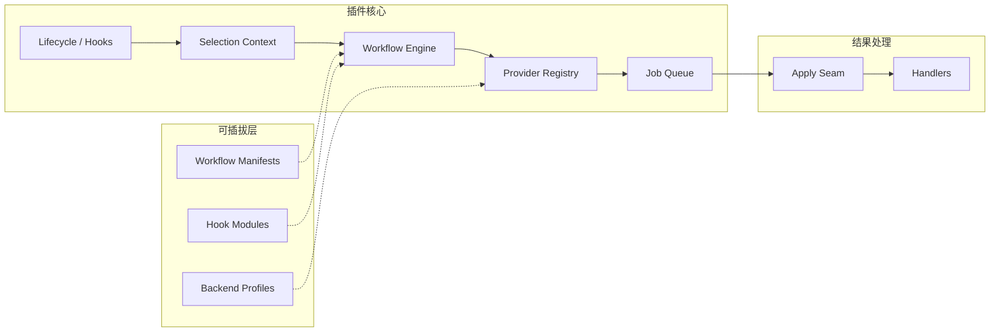

# Zotero-Skills 项目全面审计报告

> **审计时间**：2026-03-12 22:08 (UTC+8)
> **审计范围**：架构合理性、代码规范性、文档完善性、测试完善性、可维护性
> **审计版本**：v0.1.2

## 项目概述

Zotero-Skills 是一个面向 Zotero 7 的插件，作为 Skills-Runner 后端服务及其他 REST API 的通用前端。插件以模块化、工作流可插拔为核心设计理念，本体提供通用 UI 界面与菜单，由用户通过工作流文件定义具体业务逻辑。

- **版本**：0.1.2（早期阶段）
- **许可**：AGPL-3.0-or-later
- **构建目标**：Firefox 115（Zotero 7 内核）
- **依赖**：ajv（Schema 校验）、zotero-plugin-toolkit

---

## 一、架构合理性评价

### 1.1 整体架构 ⭐⭐⭐⭐⭐（优秀）

**设计亮点：**

| 维度 | 评价 |
|---|---|
| **分层清晰** | 入口 → 选区上下文 → 工作流引擎 → Provider → Job Queue → 结果处理，职责边界明确 |
| **可插拔性** | 业务逻辑完全外置为 workflow 包（manifest + hooks），核心不含业务代码 |
| **多 Provider 支持** | `skillrunner`、`generic-http`、`pass-through` 三种 Provider 覆盖远端执行、通用 HTTP、本地透传 |
| **契约驱动** | Provider 请求契约系统（`src/providers/requestContracts.ts`）实现了 requestKind ↔ backend ↔ provider 的三方校验 |
| **执行管线** | 执行链路拆分为 preparation → duplicate-guard → run → apply 四个 seam，单一职责且可测试 |
| **双运行时兼容** | Loader 同时支持 Zotero（XPCOM）和 Node 运行时，通过运行时探测自动选择 IO 实现 |

**架构不足 / 改进建议：**

| 问题 | 影响 | 建议 |
|---|---|---|
| **`src/modules/` 职责过载** | 28 个文件 + 2 子目录，混合了 UI 对话框、执行逻辑、运行时管理、设置域模型等 | 按职责重组：`modules/dialogs/`、`modules/execution/`、`modules/runtime/`、`modules/settings/` |
| **Transport 层未启用** | 网络逻辑内嵌在 Provider 中，`src/transport/` 已被架构文档标注为未启用 | 若短期不复活，应删除 transport 相关文档引用避免误导；若计划复活，应在 roadmap 中明确时间线 |
| **全局状态耦合** | `addon.data` 作为 God Object 承载工作流状态、编辑器宿主、对话框引用等 | 引入轻量级状态容器或 Service Locator 模式，减少 `addon.data` 的字段膨胀 |
| **缺少事件总线** | 组件间通信依赖直接函数调用（如 `refreshWorkflowMenus()`） | 引入事件发布/订阅机制，解耦 UI 刷新与底层状态变更 |

### 1.2 执行管线设计 ⭐⭐⭐⭐⭐

`src/modules/workflowExecute.ts` 将执行链拆分为独立 seam：

| Seam | 文件 | 职责 |
|---|---|---|
| Preparation | `src/modules/workflowExecution/preparationSeam.ts` | 构建 SelectionContext + 筛选 + 构建请求 |
| Duplicate Guard | `src/modules/workflowExecution/duplicateGuardSeam.ts` | 去重检查 |
| Run | `src/modules/workflowExecution/runSeam.ts` | Job Queue 调度 + Provider 执行 |
| Apply | `src/modules/workflowExecution/applySeam.ts` | 结果落库 + 汇总 |

这是该项目最成熟的设计之一：每个 seam 可独立单测、也可组合集成测。

### 1.3 Provider 契约体系 ⭐⭐⭐⭐⭐

`src/providers/requestContracts.ts` 实现了强类型契约验证：

- `assertRequestKindSupported` — requestKind 是否已注册
- `assertRequestKindBackendCompatible` — requestKind 与 backendType 兼容性
- `assertRequestKindProviderCompatible` — requestKind 与 providerId 兼容性
- `assertRequestPayloadContract` — 请求 payload 结构校验
- `assertProviderRequestDispatchContract` — 完整调度前置校验

自定义 `ProviderRequestContractError` 包含结构化诊断字段，有利于问题定位。

### 1.4 Workflow Loader 设计 ⭐⭐⭐⭐

`src/workflows/loader.ts` 的设计体现了工程成熟度：

- 运行时探测（Zotero vs Node）自动选择 IO 方法
- Hook 模块加载的三级 fallback：ESM import → ChromeUtils → 文本转换
- 结构化诊断（`LoaderDiagnostic`）取代简单字符串错误
- 废弃字段拒绝机制

> **提示**：`transformModuleExports()` 使用正则手动剥离 `export` 关键字来实现非 ESM 环境加载，
> 这虽然是 Zotero 沙箱环境下的务实妥协，但只覆盖了常见导出模式。
> 建议添加注释明确列出已覆盖和未覆盖的导出形式。

---

## 二、代码规范性评价

### 2.1 TypeScript 使用 ⭐⭐⭐⭐

| 优点 | 不足 |
|---|---|
| 类型声明充分，核心模块类型安全度高 | `tsconfig.json` 仅 4 行，继承 `zotero-types` 配置，未启用严格模式 |
| 自定义类型（如 `ProviderExecutionResult`、`WorkflowManifest`）设计精当 | 存在 `@ts-expect-error` 注释绕过类型检查（`src/index.ts` L7, L13） |
| `typings/global.d.ts` 声明了全局类型约定 | `_globalThis` 类型声明使用 `[key: string]: any`，削弱了类型保护 |
| 辨别联合类型的使用规范（`ProviderExecutionSucceededResult \| ProviderExecutionDeferredResult`） | ESLint 规则 `@typescript-eslint/no-unused-vars` 被全局关闭 |

### 2.2 代码风格 ⭐⭐⭐⭐

- Prettier 配置合理（80 字符宽度、2 空格缩进、LF 换行）
- 使用 `@zotero-plugin/eslint-config` 社区规范
- 函数粒度适当，多数函数在 30 行以内
- 命名一致性好——`resolve*`、`normalize*`、`assert*` 前缀语义清晰

> **警告**：`src/modules/` 下存在多个超大文件，部分超 20KB：
> - `skillRunnerRunDialog.ts` — 45KB
> - `workflowSettingsDialog.ts` — 31KB
> - `backendManager.ts` — 28KB
> - `examples.ts` — 25KB
> - `taskManagerDialog.ts` — 24KB
>
> 这些 Dialog 文件大概率混合了 DOM 构建、事件绑定、业务逻辑。建议拆分为 Model/View/Controller 或至少抽取 DOM 构建函数。

### 2.3 错误处理 ⭐⭐⭐⭐⭐

- 自定义 `ProviderRequestContractError` 和 `WorkflowLoaderDiagnosticError` 携带结构化上下文
- Backend 加载区分 fatal error（全局不可用）和 entry-level error（单条失败不阻塞）
- Job Queue 中的错误不会中断队列排水
- 运行时日志管理器（`src/modules/runtimeLogManager.ts`）贯穿全链

### 2.4 防御性编程 ⭐⭐⭐⭐

- `isObject()`、`isNonEmptyString()` 等守卫函数频繁且一致地使用
- `normalizeRequestKind()`、`normalizeBackendEntry()` 对输入做规范化而非假设格式正确
- upload_files 校验 key 唯一性、路径合法性、`..` 穿越防护

> **注意**：`isObject()` 和 `isNonEmptyString()` 在多个文件中重复定义
> （`src/providers/requestContracts.ts`、`src/backends/registry.ts`、`src/workflows/loader.ts` 等）。
> 建议提取到 `src/utils/guards.ts` 统一复用。

---

## 三、文档完善性评价

### 3.1 架构文档 ⭐⭐⭐⭐⭐

项目文档非常完善，是在同类 Zotero 插件项目中罕见的高水准：

| 文档 | 内容 |
|---|---|
| `doc/architecture-flow.md` | 运行逻辑总览 + Mermaid 流程图 |
| `doc/dev_guide.md` | 核心组件索引 + 配置模型 + 执行链路 + 文档索引 |
| `doc/testing-framework.md` | 双环境测试策略 + lite/full 规则 + 门禁语义 |

### 3.2 组件文档 ⭐⭐⭐⭐⭐

`doc/components/` 下有 **15 篇**组件级文档，覆盖所有核心组件：

| 类别 | 文档 |
|---|---|
| 工作流 | `workflows.md`（16KB，最详尽）、`workflow-hook-helpers.md` |
| Provider | `providers.md`、`skillrunner-provider-state-machine-ssot.md` |
| 选区/上下文 | `selection-context.md`、`selection-context.schema.json` |
| Handler | `handlers.md` |
| Job Queue | `job-queue.md` |
| UI | `ui-shell.md` |
| 测试 | `test-suite-governance.md`、`test-taxonomy-domain-map.md`、`zotero-mock.md`、`zotero-mock-parity.md` |
| Transport | `transport.md`（标注未启用） |
| Local Cache | `local-cache.md`（占位设计） |

### 3.3 文档不足

| 问题 | 建议 |
|---|---|
| 缺少面向用户的安装与使用文档 | README.md 基本保持模板状态，应补充安装步骤、基本用法、截图 |
| 缺少 API / 公共接口文档 | Handler API、Workflow Hook API 仅在代码中通过类型定义，缺少独立 API Reference |
| 缺少 CHANGELOG | 项目已有 release 脚本但无版本变更记录 |
| 部分文档引用失效 | `dev_guide.md` 引用的 `doc/architecture-hardening-baseline.md` 在目录中未找到 |

---

## 四、测试完善性评价

### 4.1 测试覆盖 ⭐⭐⭐⭐⭐（突出）

| 域 | 测试文件数 | 主要覆盖 |
|---|---|---|
| `test/core/` | **41** | 选区上下文、Handler、Workflow 加载/执行、Provider 契约、Job Queue、Backend 注册、状态机、Runtime Bridge 等 |
| `test/ui/` | **6** | 启动菜单初始化、Workflow Settings 执行流、GUI 首选项扫描、Editor Host、Log Viewer |
| `test/workflow-*` | **8 目录** | literature-digest、literature-explainer、mineru、reference-matching、reference-note-editor、tag-manager、tag-regulator |

### 4.2 测试基础设施 ⭐⭐⭐⭐⭐

| 能力 | 实现 |
|---|---|
| **Zotero Mock** | `test/setup/zotero-mock.ts`（45KB），模拟完整 Zotero API |
| **Mock SkillRunner** | `test/mock-skillrunner/` — 含 `server.ts` (15KB) 和 `contracts.ts` |
| **Fixtures** | 9 个 fixture 目录覆盖选区上下文、工作流加载异常场景、文献消化、参考匹配 |
| **双运行环境** | Node（`mocha + tsx`）和 Zotero（`zotero-plugin-scaffold test`）双跑 |
| **lite/full 分级** | PR Gate 跑 lite（高信号快速），Release Gate 跑 full（全量深度） |
| **域分组** | `core`、`ui`、`workflow` 三域可独立运行 |
| **CI 门禁** | `scripts/run-ci-gate.ts` 支持 `pr` 和 `release` 两种 gate 策略 |

### 4.3 测试治理 ⭐⭐⭐⭐

- **测试编号系统** — 文件名形如 `00-startup.test.ts`、`56-declarative-request-compiler-guards.test.ts`，编号表达依赖顺序
- **testMode.ts** — 检测 lite/full 模式，控制用例降维
- **Mock parity governance** — `53-zotero-mock-parity-governance.test.ts` 验证 Mock 与真实 API 的一致性
- **Suite governance** — `58-suite-governance-constraints.test.ts` 对测试套件本身做约束验证

### 4.4 测试不足

| 问题 | 建议 |
|---|---|
| 缺少代码覆盖率报告 | 集成 `c8` 或 `istanbul` 生成覆盖率，CI 门禁中加入覆盖率阈值 |
| Dialog 类文件（UI 重型模块）测试偏少 | `skillRunnerRunDialog.ts`（45KB）、`backendManager.ts`（28KB）等大文件的 UI 行为测试不充分 |
| 无端到端集成测试 | 从用户右键触发 → Provider 执行 → 结果落库的完整异步流未见自动化 E2E 测试 |

---

## 五、可维护性评价

### 5.1 代码组织 ⭐⭐⭐⭐

| 优点 | 改进方向 |
|---|---|
| 源码按功能域分目录（`backends/`、`providers/`、`workflows/`、`handlers/`、`jobQueue/`） | `src/modules/` 过度膨胀（30 文件），应进一步拆分 |
| 执行管线拆分为独立 seam 文件（`workflowExecution/`） | 部分 dialog 文件与 domain model 耦合较深 |
| Schema 定义集中在 `src/schemas/` | 配置默认值散落在 `src/config/defaults.ts` 和各注册表中 |

### 5.2 依赖管理 ⭐⭐⭐⭐⭐

- 运行时依赖极为精简（仅 `ajv` + `zotero-plugin-toolkit`）
- 开发依赖规范（`eslint`、`prettier`、`mocha`、`chai`、`tsx`、`typescript`、`zotero-types`）
- 使用 `zotero-plugin-scaffold` 构建框架，与社区标准对齐

### 5.3 Runtime Bridge 模式 ⭐⭐⭐⭐

`src/utils/runtimeBridge.ts` 统一了运行时全局能力的访问路径，测试时可注入/重置，避免全局状态污染。这比直接 `globalThis.addon` 更可维护。

### 5.4 可维护性风险

| 风险 | 严重度 | 说明 |
|---|---|---|
| **超大文件** | 🟡 中 | 5 个文件超 20KB，最大 45KB。长期增长后阅读和修改成本递增 |
| **工具函数重复** | 🟢 低 | `isObject`、`isNonEmptyString` 等在 4+ 文件中重复定义 |
| **`examples.ts` 遗留** | 🟢 低 | 25KB 的模板示例文件（`BasicExampleFactory`）仍在生产构建中引入 |
| **全局 ESLint 规则放松** | 🟢 低 | `no-unused-vars: off` 全局禁用会掩盖死代码 |

---

## 六、综合评分

| 维度 | 评分 | 评语 |
|---|---|---|
| **架构合理性** | ⭐⭐⭐⭐⭐ | 分层清晰、契约驱动、执行管线拆解精细，在 Zotero 插件生态中堪称标杆 |
| **代码规范性** | ⭐⭐⭐⭐ | 类型系统利用充分、防御性编程佳，但有超大文件和重复工具函数的技术债 |
| **文档完善性** | ⭐⭐⭐⭐½ | 内部架构文档极其完善（15 篇组件文档），但面向用户的文档（README/CHANGELOG）缺失 |
| **测试完善性** | ⭐⭐⭐⭐⭐ | 55+ 测试文件、双运行环境、lite/full 分级、治理约束测试，在同类项目中极为突出 |
| **可维护性** | ⭐⭐⭐⭐ | Runtime Bridge、Schema SSOT、结构化诊断等模式提升了可维护性；`modules/` 膨胀是主要风险 |

## 七、优先改进建议 Top 5

1. **重组 `src/modules/`** — 按职责拆分为 `dialogs/`、`execution/`、`runtime/`、`settings/` 子目录
2. **提取共享工具函数** — `isObject`、`isNonEmptyString`、`delayMs` 等收拢到 `src/utils/guards.ts`
3. **清理 `examples.ts`** — 将模板示例代码从生产构建中移除或隔离
4. **补充用户文档** — README 添加安装步骤、使用指南、截图；新建 CHANGELOG.md
5. **集成覆盖率** — 在 CI 门禁中加入代码覆盖率检查
