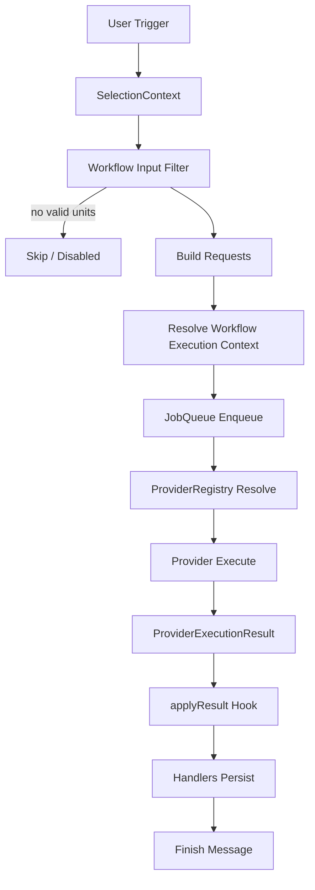

# Architecture Flow（运行逻辑总览）

本文档描述当前实现下的执行主链路。

硬化基线与技术债盘点请见：`doc/architecture-hardening-baseline.md`。

## Mermaid 流程图（当前实现）

## 1. 启动阶段

1. 扫描 workflow 目录并加载 manifests/hooks  
2. 初始化右键菜单  
3. 首选项与菜单入口可触发：
   - 重新扫描 workflows
   - Backend Manager
   - Workflow Settings
   - Task Manager

## 2. 触发阶段

1. 用户在右键菜单选择 workflow  
2. 构建 SelectionContext  
3. 执行声明式输入筛选 + 可选 `filterInputs`
4. 若无合法输入单元：本次执行跳过并提示

## 3. 构建与调度

1. 对每个合法输入单元构建 request
   - `hooks.buildRequest` 优先
   - 否则走声明式 `request` 编译
2. 解析 execution context
   - backend profile（workflow settings）
   - request kind（workflow + backend type）
   - workflow params / provider options（persisted + run-once）
3. 入队执行（FIFO + 固定并发）

## 4. Provider 执行

1. `ProviderRegistry` 按 `requestKind + backend.type` 选择 provider  
2. provider 发起网络请求并返回 `ProviderExecutionResult`
3. 结果形态可能是：
   - `bundle`（含 `bundleBytes`）
   - `result`（含 `resultJson`）

说明：当前没有启用独立 transport 层，网络执行在 provider 内部完成。

## 5. 结果落库

1. `workflowExecute` 根据结果构造 `bundleReader`（或不可用占位 reader）  
2. 调用 workflow `applyResult`  
3. 由 handlers 写入 Zotero（note/tag/attachment 等）

## 6. 任务管理窗口

- 记录并展示任务状态：`queued/running/completed`
- 窗口打开时会清理已完成任务

## 7. 失败路径

- Workflow 加载失败：跳过该 workflow，记录 warning
- 输入筛选后无合法输入：跳过执行
- Provider 执行失败：任务标记 failed
- applyResult 失败：该任务标记 failed，并进入汇总错误
