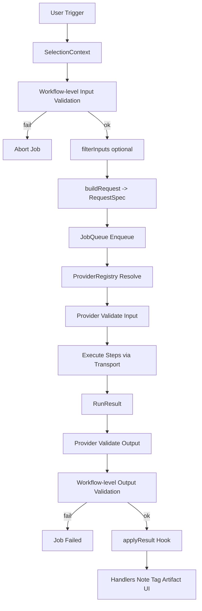

# Architecture Flow（运行逻辑总览）

本文档描述 Zotero Skills 插件的核心运行逻辑与组件协作关系。用于指导实现与测试拆分。

---

## Mermaid 流程图（M1）

## 1. 注册与生成（Workflow）

1) Workflow 包目录扫描  
- 由 UI Shell 在启动时读取用户配置的 workflow 目录  
- 扫描并解析每一个 workflow 包（workflow.json + hooks）

2) Manifest 注册  
- 解析 workflow.json 并注册到 Workflow Registry  
- hooks 路径做可用性检查

3) UI 注册  
- UI Shell 根据 manifest 生成配置入口  
- 右键菜单按 Workflow 分组注册

---

## 2. 触发与上下文获取（Selection/Context）

1) 用户触发  
- 在 Zotero 库条目上右键选择某个 Workflow

2) 上下文构建  
- Selection/Context 获取当前选择对象  
- 输出完整上下文（Metadata + 附件 + 注释 + 标签 + 集合 + 父子条目）

---

## 3. 任务处理（Job Queue + Provider + Transport）

1) Job 请求构建  
- Job 队列接收 Selection Context + Workflow manifest  
- 执行 filterInputs（可选）与 Workflow-level 输入校验  
  - 校验失败：不创建 Job  
  - 校验通过：调用 buildRequest 生成 RequestSpec 并入队

2) 调度执行  
- FIFO 调度  
- 并发上限由 Workflow 指定  
- 每个 Job 拥有独立控制流与状态机

3) Provider 执行  
- ProviderRegistry 选择 Provider（基于 requestSpec.kind / backend.type）  
- Provider 执行 Backend-level 输入校验  
- Provider 将 steps 交给 Transport 执行  
- 聚合 step 结果 → RunResult

4) 输出校验  
- Backend-level 输出校验（Provider）  
- Workflow-level 输出校验（基于 manifest.result.expects）

---

## 4. 结果处理（Handlers）

1) applyResult 处理  
- 由 applyResult Hook 决定如何应用结果  
- 可选择调用默认 Handlers

2) 处理策略  
- NoteHandler：生成/更新 Note  
- TagHandler：添加/移除标签  
- ArtifactHandler：保存产物附件  
- UISummaryHandler：展示摘要与状态

3) 失败隔离  
- Handler 之间彼此独立  
- 某个 Handler 失败不影响其他处理流程

---

## 5. UI Shell 与任务管理窗口

1) UI Shell 负责触发与展示  
- 右键菜单按 Workflow 分组  
- 入口仅触发，不做输入校验

2) 独立任务管理窗口  
- 展示 Job 状态列表（queued/running/succeeded/failed）  
- 支持查看日志、产物、错误详情  
- 支持取消任务

---

## 6. 失败路径总结

- Workflow 解析失败：注册时忽略并记录错误  
- 输入校验失败：Job 不创建  
- Provider/Transport 失败：Job 标记 failed，返回可追踪错误  
- 输出校验失败：Job 标记 failed，记录错误  
- Handler 失败：记录 warning，不影响其他 Handler
