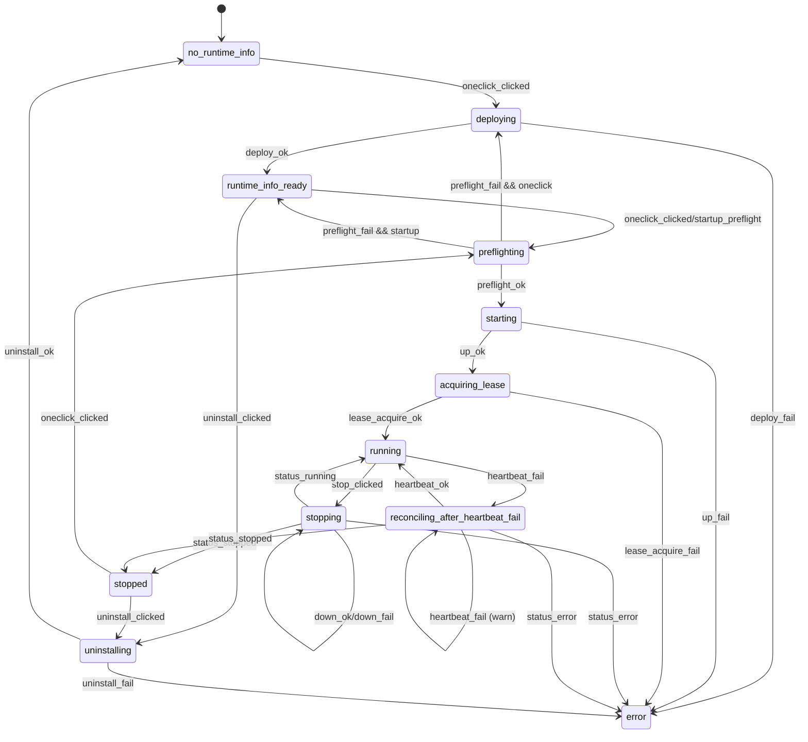
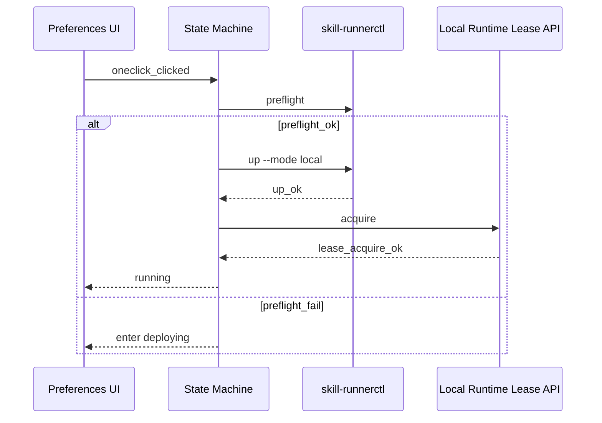
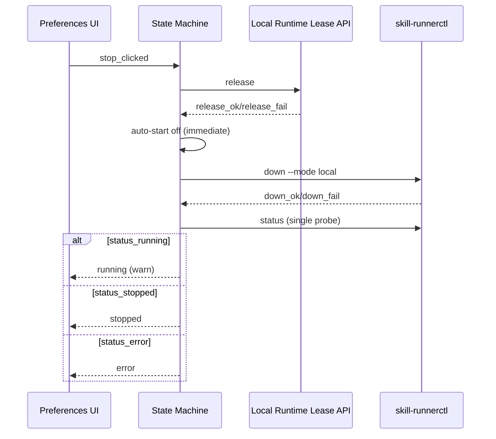

# SkillRunner Local Runtime One-Click State Machine SSOT

## Purpose

本文档作为 SkillRunner 本地一键部署/启动能力的状态机 SSOT，约束按钮动作、状态收敛、监测启停与不变量守护。  
该文档只定义行为合同，不包含业务实现代码。

## State Model

### States

- `no_runtime_info`
- `runtime_info_ready`
- `preflighting`
- `deploying`
- `starting`
- `acquiring_lease`
- `running`
- `stopping`
- `reconciling_after_heartbeat_fail`
- `stopped`
- `uninstalling`
- `error`

### Events

- `oneclick_clicked`
- `preflight_ok`
- `preflight_fail`
- `deploy_ok`
- `deploy_fail`
- `up_ok`
- `up_fail`
- `lease_acquire_ok`
- `lease_acquire_fail`
- `stop_clicked`
- `lease_release_ok`
- `lease_release_fail`
- `down_ok`
- `down_fail`
- `status_running`
- `status_stopped`
- `status_error`
- `heartbeat_ok`
- `heartbeat_fail`
- `uninstall_clicked`

### Transition Diagram



## Button and Action Contract

### Final Actions

- One-click deploy/start
- Stop
- Uninstall

### Availability Matrix

- Global: only one action can be in-flight.
- `running`:
  - stop enabled
  - one-click disabled
  - uninstall disabled
- `starting` or any non-empty `inFlightAction`:
  - one-click disabled
  - stop disabled
  - uninstall disabled
- `no_runtime_info`:
  - uninstall disabled

### One-Click Branching

- With runtime info:
  - preflight first
  - success -> `up -> lease acquire`
  - failure -> deploy
- Without runtime info:
  - deploy directly
- Deploy return contract:
  - `deploy_ok` must wait for `post_deploy_preflight`
  - `post_deploy_preflight_ok` => return `deploy-complete` and trigger auto-ensure asynchronously
  - `post_deploy_preflight_fail` => return `post-deploy-preflight` failure and do not trigger auto-ensure

## Sequence Contract

### One-Click With Runtime Info



### Manual Stop (Release Then Down Then Status Probe)



### Heartbeat Fail Reconciliation

```mermaid
sequenceDiagram
    participant Monitor as Runtime Monitor
    participant Lease as Local Runtime Lease API
    participant Ctl as skill-runnerctl
    participant SM as State Machine

    Lease-->>Monitor: heartbeat_fail
    Monitor->>Ctl: status (first probe)
    alt status_stopped
      SM-->>Monitor: stopped (end)
    else status_running
      loop interval = heartbeat_interval_seconds || 20
        par heartbeat channel
          Lease-->>Monitor: heartbeat_ok/heartbeat_fail
        and status channel
          Monitor->>Ctl: status
          Ctl-->>Monitor: status_running/status_stopped/status_error
        end
        alt heartbeat_ok
          SM-->>Monitor: running; stop status polling
          break
        else heartbeat_fail
          SM-->>Monitor: warning; continue
        end
        alt status_stopped
          SM-->>Monitor: stopped; stop monitoring
          break
        else status_error
          SM-->>Monitor: error
          break
        end
      end
    else status_error
      SM-->>Monitor: error
    end
```

## Invariants

1. Action Mutex
- At most one runtime action may be in-flight.

2. Lease Terminology
- The contract must use `lease acquire` only; `require` is invalid terminology.

3. Startup Policy
- Auto-start defaults to disabled on startup.
- Startup runs preflight only when runtime info exists.
- No runtime info on startup means no runtime action.

4. Auto-Start Toggle Policy
- Any preflight success with runtime info enables auto-start.
- Any preflight failure with runtime info disables auto-start.
- Without runtime info, auto-start stays disabled.
- Applies to both manual and automatic paths.
- Manual `stop` always disables auto-start immediately.

5. Monitoring Lifecycle
- Monitoring starts only after `up_ok`.
- Monitoring stops when state becomes `stopped`.
- Monitoring restarts only after next successful manual/auto up.

6. Heartbeat Fail Reconciliation
- Heartbeat fail always triggers one immediate status probe.
- If first status is running, a single status poller must be active.
- Heartbeat success during reconciliation must cancel status polling.
- Heartbeat failure during reconciliation must emit warning and continue polling.

7. Preferences Refresh Consistency
- Runtime state changes from manual actions and background auto-ensure must emit the same state-change signal.
- Preferences page must refresh snapshot from `stateSkillRunnerLocalRuntime` on that signal.

8. Runtime Info Lifecycle
- Runtime info must be persisted.
- New deploy overwrites existing runtime info.
- Uninstall clears runtime info immediately at entry, regardless of uninstall result.
- Runtime info is bound to managed backend context and isolated from normal backend overwrite flow.

9. Script Existence Rule
- With runtime info present, missing `skill-runnerctl` must raise visible error.

## Guard Interface Draft

```ts
export type Violation = {
  ruleId: string;
  stage: string;
  context: Record<string, unknown>;
  reason: string;
  severity: "info" | "warning" | "error";
};

export type GuardResult<T> = {
  output: T;
  violations: Violation[];
};

export function transitionGuard(prev: State, event: Event, ctx: Context): GuardResult<State>;
export function actionMutexGuard(inFlightAction: Action | null, incomingAction: Action): GuardResult<boolean>;
export function buttonEnablementGuard(state: State, hasRuntimeInfo: boolean, inFlight: boolean): GuardResult<ButtonState>;
export function autoStartToggleGuard(hasRuntimeInfo: boolean, preflightResult: "ok" | "fail" | "skip", source: "startup" | "manual" | "auto"): GuardResult<boolean>;
export function monitorGuard(upResult: "ok" | "fail", state: State): GuardResult<MonitorState>;
export function reconcileAfterHeartbeatFail(ctx: ReconcileContext): GuardResult<State>;
```

## Out of Scope

- Business code implementation.
- Poll timeout and retry budget policy.
- Warning aggregation policy.

## Implementation Mapping

| SSOT Contract | Runtime Entry |
| --- | --- |
| one-click button | `deploySkillRunnerLocalRuntime` -> `deployAndConfigureLocalSkillRunner` |
| stop chain | `stopSkillRunnerLocalRuntime` -> `stopLocalRuntime` |
| uninstall | `uninstallSkillRunnerLocalRuntime` -> `uninstallLocalRuntime` |
| startup preflight | `onStartup` -> `runManagedRuntimeStartupPreflightProbe` |
| auto ensure tick | `runManagedRuntimeAutoEnsureTick` |
| heartbeat reconciliation | `heartbeatLease` + `reconcileAfterHeartbeatFail` + status poll loop |
| UI gate snapshot | `stateSkillRunnerLocalRuntime` -> `getManagedLocalRuntimeStateSnapshot` |

### Debug Console Exception

- `openSkillRunnerLocalDeployDebugConsole` remains always available in preferences UI.
- This action is intentionally outside runtime action gate and does not participate in one-click/stop/uninstall mutex.
- This action must not write runtime status-bar working/success/fail text.
