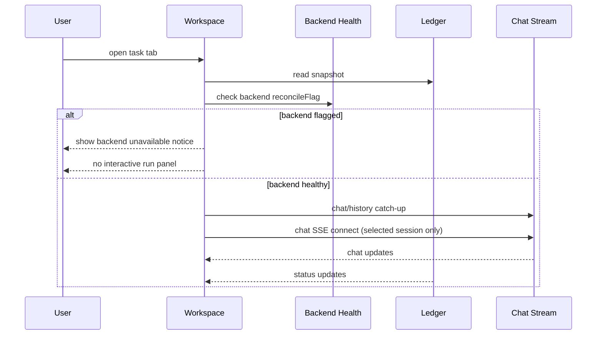

# SkillRunner Global Run Workspace Tabs SSOT (v3, Backend-Gated)

## 1. Purpose

Define the singleton run workspace behavior under backend-level reconcile gating:

- left workspace groups and right detail panel share one snapshot lineage
- run dialog entry and interactivity are gated by backend health
- chat stream ownership is strictly single-session

## 2. Data Sources

### Status

Read from ledger snapshot only (provider SSOT guarded writes).

### Chat content

Read from jobs chat history/SSE only for currently selected session.

### Pending interaction payload

Read from jobs pending endpoint.
If refresh fails in waiting state, retain last-good payload until new valid payload arrives.

## 3. First Frame Contract

Open session flow:

1. render status from ledger snapshot
2. check backend reconcile flag
3. if backend is flagged, block entering interactive run view and render explicit unavailable notice
4. if backend is healthy, start selected-session chat stream

Refresh failure must not rewrite waiting state back to running.

## 4. Stream Ownership Contract

### Chat stream

- at most one active chat stream globally
- owned by current selected session in singleton run workspace
- switching selected task disconnects old stream before connecting new stream
- closing workspace disconnects stream immediately

### Event stream

- event stream is external to workspace ownership and follows provider SSOT lifecycle (running-only)
- workspace never creates duplicate event stream ownership loops

## 5. Backend-Flagged Group Contract

For backend group with `reconcileFlag=true`:

- group header shows unavailable marker
- group cannot expand/collapse interactively
- no task bubbles rendered in the group
- clicking group has no navigation effect

This prevents opening non-actionable run dialogs while backend is unreachable.

## 6. Dashboard and Workspace Consistency

For healthy backends:

- same request status must match among:
  - dashboard row
  - workspace left bubble label
  - run banner

For flagged backends:

- dashboard home running list omits those tasks
- workspace left group is disabled/no bubbles
- run dialog entry is blocked

## 7. Restart Replay Contract

After plugin restart:

1. running snapshots are reconnect candidates (if backend healthy)
2. waiting/terminal snapshots are not auto-streamed
3. opening waiting session on healthy backend must restore waiting state and pending UI
4. opening session on flagged backend is blocked with explicit reason

## 8. Terminal Contract

When terminal is confirmed:

- workspace reflects terminal state from ledger
- chat stream for that session disconnects
- terminal side effects are handled by reconciler (not workspace)

## 9. Sequence

## 10. Apply Trigger Note (Restart Recovery)

- run/workspace UI still consumes unified snapshot lineage.
- `succeeded` apply execution depends on reconciler recoverable context:
  - context present: apply executes once
  - context missing (legacy running task): state converges, apply skipped, warning shown
