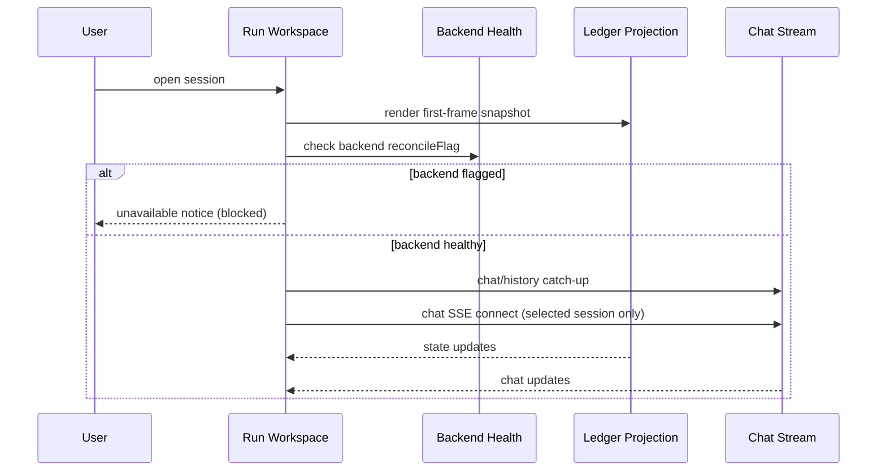

# SkillRunner Global Run Workspace Tabs SSOT (Lockdown v4)

## 1. Scope

This document defines run-workspace-side SSOT behavior under provider lockdown rules.
It governs how the singleton run workspace consumes provider projection and stream outputs.

- Workspace never owns provider truth.
- Workspace renders unified snapshot + selected-session chat/pending views.
- Backend reconcile gating is enforced before any interactive run path.

## 2. Data Sources

Status source:

- unified request snapshot from provider ledger projection

Chat source:

- selected session only via jobs chat history/SSE

Pending source:

- jobs pending endpoint for selected waiting session
- on pending refresh failure, keep last-good pending view for current waiting session

## 3. Invariant Catalog (Workspace)

### INV-WS-RUN-DIALOG-SINGLETON

- Trigger: opening run dialog from any entry.
- Allowed: one singleton workspace window/tab context.
- Forbidden: parallel run-dialog instances competing for session ownership.
- Observability: open-run routing behavior and active workspace state.

### INV-WS-CHAT-SSE-SINGLE-OWNER

- Trigger: selected session changes or workspace closes.
- Allowed:
  - selected session owns chat stream
  - previous session chat stream disconnects immediately.
- Forbidden: multiple concurrent chat stream owners.
- Observability: chat stream lifecycle events per selected session.

### INV-WS-STATE-RENDER-FROM-LEDGER

- Trigger: session view render and refresh.
- Allowed: status label/banner derived from unified snapshot projection.
- Forbidden: run dialog local speculative status transitions.
- Observability: state update path `events -> ledger -> dialog subscriber -> snapshot`.

### INV-WS-BACKEND-FLAGGED-GROUP-DISABLED

- Trigger: backend `reconcileFlag=true`.
- Allowed:
  - backend group marked unavailable
  - group non-interactive
  - no task bubbles rendered
  - open-run blocked with explicit notice.
- Forbidden: flagged backend task becoming selectable/openable in workspace.
- Observability: workspace groups snapshot and open-run guard.

### INV-WS-FIRST-FRAME-NO-FORCED-RUNNING

- Trigger: open session first frame after switch/restart.
- Allowed: first frame status uses ledger snapshot.
- Forbidden: failed refresh forcing waiting/terminal snapshot back to running.
- Observability: first-frame render and refresh-failure branch.

### INV-WS-PENDING-EDGE-RULES

- Trigger: waiting-edge transitions.
- Allowed:
  - non-waiting -> waiting edge triggers pending fetch
  - waiting -> running/queued/terminal clears pending card
  - fetch failure retains last-good pending while waiting.
- Forbidden: immediate pending wipe on transient fetch failure.
- Observability: pending card rendering state transitions.

## 4. Backend Gating UX (Workspace View)

For backend with `reconcileFlag=true`:

- workspace group is disabled and cannot expand/collapse interactively
- no task bubbles under that backend
- attempts to open run dialog are blocked

Consistency with dashboard:

- dashboard home running list hides flagged backend tasks
- backend tab disabled semantics match workspace disabled semantics

## 5. Restart Replay Contract

After plugin restart:

1. running snapshots are reconnect candidates (backend healthy only)
2. waiting/terminal snapshots are not auto-streamed
3. opening waiting session on healthy backend restores waiting status + pending UI
4. opening session on flagged backend is blocked

## 6. Terminal and Apply Note

- workspace consumes terminal convergence from unified snapshot
- terminal side effects are reconciler-owned, not workspace-owned
- when terminal succeeds but context is missing, state converges and apply is skipped with explicit warning
- when SkillRunner `auto` is foreground-complete but reconciler-owned pending, workspace waits for reconciler terminal convergence and does not own final summary timing

## 7. Sequence (Simplified)

