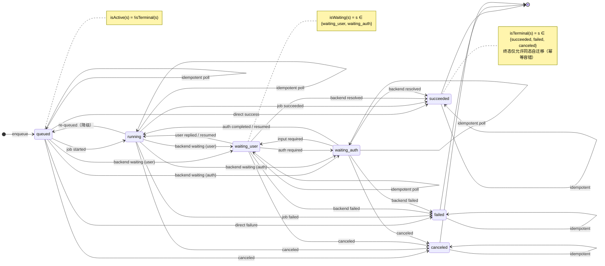
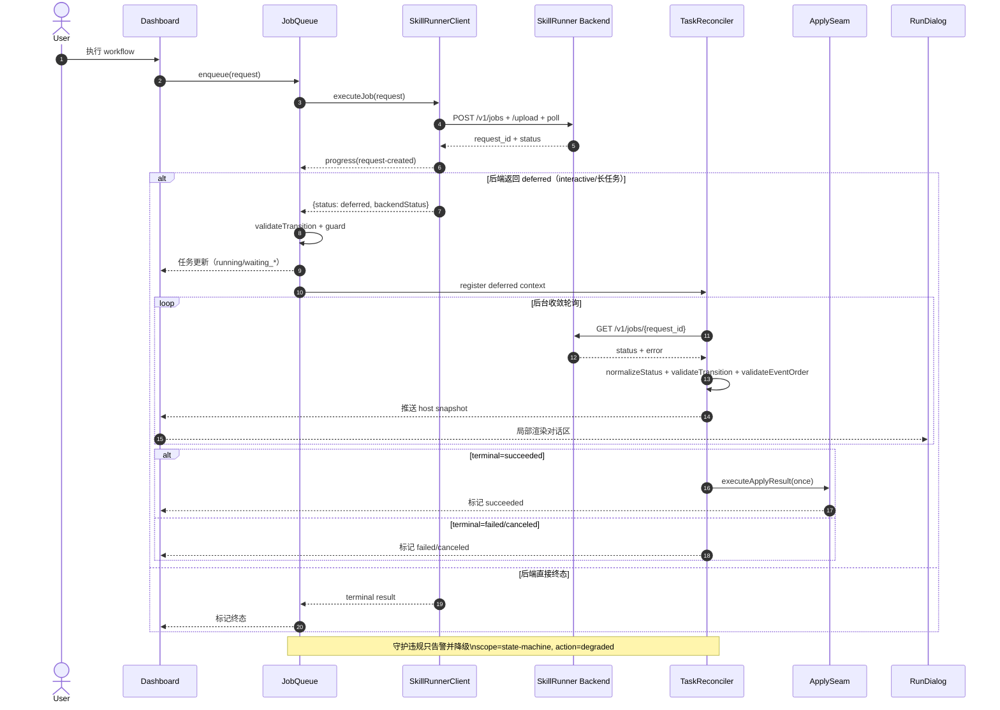

# SkillRunner Provider 状态机 SSOT

## 目标与边界

- 统一插件侧 SkillRunner 运行状态语义，避免 provider/client、queue、reconciler、apply、dashboard/run-dialog 各自维护状态逻辑。
- 该 SSOT 仅覆盖“插件发起的 SkillRunner 任务”。
- 后端状态机仍是运行事实源；插件侧 SSOT 的职责是“统一消费 + 不变量守护 + 容错降级”。

实现入口：`src/modules/skillRunnerProviderStateMachine.ts`。

## 规范状态集合

- `queued`
- `running`
- `waiting_user`
- `waiting_auth`
- `succeeded`
- `failed`
- `canceled`

判定辅助：

- `isTerminal(status)`：`succeeded | failed | canceled`
- `isWaiting(status)`：`waiting_user | waiting_auth`
- `isActive(status)`：非终态

## 归一化与未知状态策略

- `normalizeStatus(raw, fallback)`：将任意输入归一化到上述状态集合。
- `normalizeStatusWithGuard(...)`：在归一化基础上返回可观测 violation。
- 未知状态不抛硬错误，降级为安全非终态（默认 `running`），并记录：
  - `ruleId=status.unknown`
  - `action=degraded`
  - `rawStatus` 与 `fallbackState`

## 合法迁移矩阵

- `queued` 可迁移到：`queued | running | waiting_user | waiting_auth | succeeded | failed | canceled`
- `running` 可迁移到：`queued | running | waiting_user | waiting_auth | succeeded | failed | canceled`
- `waiting_user` 可迁移到：`running | waiting_user | waiting_auth | succeeded | failed | canceled`
- `waiting_auth` 可迁移到：`running | waiting_user | waiting_auth | succeeded | failed | canceled`
- `succeeded` 仅可迁移到：`succeeded`
- `failed` 仅可迁移到：`failed`
- `canceled` 仅可迁移到：`canceled`

非法迁移触发 `ruleId=transition.illegal`，运行时执行“告警+降级”而非中断任务。

## 事件序不变量

关键事件：

- `request-created`
- `deferred`
- `waiting`
- `waiting-resumed`
- `terminal`
- `apply-succeeded`

守护规则：

- `deferred` 之前必须出现 `request-created`（`event.deferred_without_request_created`）。
- `waiting-resumed` 之前必须出现 `waiting`（`event.resume_without_waiting`）。
- `terminal` 事件若携带非终态状态值，记 `event.terminal_non_terminal_status`。
- `apply-succeeded` 必须在 `terminal(succeeded)` 之后（`event.apply_without_terminal_success`）。
- `apply-succeeded` 最多一次（`event.apply_multiple_times`）。

## 状态机图

## 执行时序图

## 运行时诊断日志契约

状态机守护日志统一写入：

- `scope=state-machine`
- `stage=state-machine-guard`
- `details.ruleId`
- `details.action=degraded`
- 以及 `requestId/prevState/nextState/eventKind` 上下文

该日志用于排查状态漂移，但不会中断任务执行。
