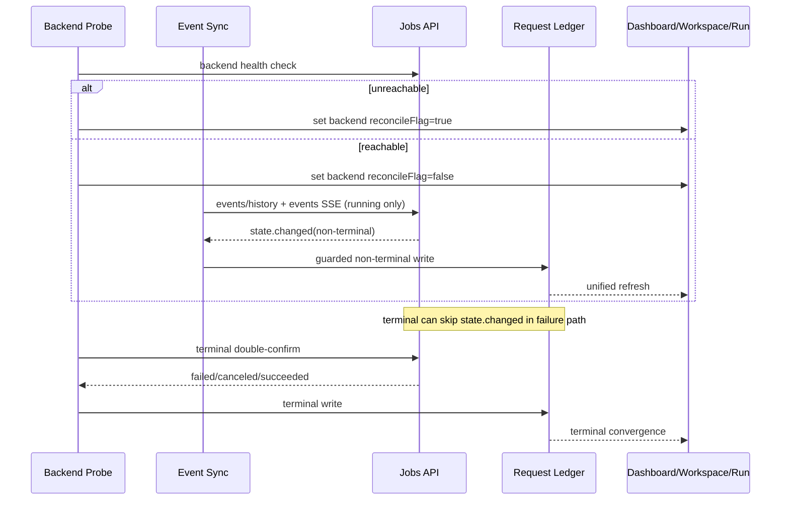

# SkillRunner Provider State Machine SSOT (v3, Reconcile-Gated)

## 1. Scope

This SSOT defines the only valid runtime-state governance model in the plugin for SkillRunner tasks:

- backend jobs semantics are SSOT
- plugin is observer-only for non-terminal states
- reconcile gating is backend-scoped
- stream lifecycle is bounded by state and active UI ownership

This document replaces prior request-scoped reconcile and mixed-owner stream behavior.

## 2. Canonical Task States

`queued | running | waiting_user | waiting_auth | succeeded | failed | canceled`

Terminal:

- `succeeded`
- `failed`
- `canceled`

Non-terminal:

- `queued`
- `running`
- `waiting_user`
- `waiting_auth`

## 3. Truth Inputs

### 3.1 Events Channel (state channel)

- source: `/v1/jobs/{request_id}/events/history` + `/v1/jobs/{request_id}/events` SSE
- ownership: state projection only
- non-terminal writes originate only here

### 3.2 Jobs Terminal Check (terminal override channel)

- source: `/v1/jobs/{request_id}` status
- ownership: terminal convergence only
- used when backend failure path has no terminal `conversation.state.changed`

### 3.3 Chat Channel (display channel)

- source: `/v1/jobs/{request_id}/chat/history` + `/v1/jobs/{request_id}/chat` SSE
- ownership: conversation display only
- never writes task state

## 4. Ledger Contract (Minimal)

Ledger record keeps only:

- `requestId`
- `snapshot`
- minimal metadata for UI (`backendId/backendType/workflowLabel/taskName/runId/jobId`)
- `updatedAt`

No local conversation message persistence.
No request-level reconcile flag writes.

### 4.1 Persistence Substrate (Plugin Scope SQLite)

Runtime persistence for ledger/context/task rows is plugin-scope SQLite:

- DB file: `<Zotero.DataDirectory>/zotero-skills/state/zotero-skills.db`
- store entry: `pluginStateStore`
- task tables:
  - `plugin_task_requests`
  - `plugin_task_contexts`
  - `plugin_task_rows`

Current task domain: `skillrunner`.
Legacy prefs (`skillRunnerDeferredTasksJson`, `skillRunnerRequestLedgerJson`, `taskDashboardHistoryJson`) are migration input only and not runtime truth after migration.

## 5. Write Guards (Hard Invariants)

### 5.1 NonTerminalWriteGuard

`queued/running/waiting_user/waiting_auth` may be written only by events channel semantics.

Any non-terminal write attempt from reconciler/jobs probing is invalid.

### 5.2 TerminalOverrideGuard

`succeeded/failed/canceled` may be written by jobs double-confirm terminal path.

This is the only allowed non-events write path and exists for backend failure normalization.

### 5.3 Observer-Only Rule

Plugin can only follow backend truth; it must not fabricate non-terminal progression or downgrades.

## 6. Backend Health Registry (Backend-Scoped Reconcile Flag)

Health state keyed by `backendId`:

- `reachable`
- `reconcileFlag`
- `backoffLevel`
- `nextProbeAt`
- `lastError`

Probe endpoint:

- `HEAD /v1/system/ping` (preferred)
- `GET /v1/system/ping` (fallback within ping endpoint family)

Probe cadence:

- level 0: 5s
- level 1: 15s
- level 2: 60s

Gate transition rule:

- enter `reconcileFlag=true` only after 2 consecutive failures
- recover (`reconcileFlag=false`) on first successful probe
- reset to level 0 on recovery

Registry is runtime-only (rebuilt on startup), not persisted.
When a backend profile is removed, registry tracking for that backend is
removed immediately and active streams for that backend are stopped.

## 7. Stream Lifecycle Contract

### 7.1 Event SSE

- auto-connect candidates on startup: only tasks with `snapshot=running`
- connect is blocked when backend `reconcileFlag=true`
- disconnect immediately when snapshot becomes:
  - `waiting_user`
  - `waiting_auth`
  - terminal

### 7.2 Chat SSE

- run dialog is singleton
- only selected session owns chat SSE
- on tab switch / dialog close, previous chat stream disconnects immediately
- run dialog status rendering is event-driven via global state subscription
  (`events -> ledger -> dialog subscriber -> snapshot`), not periodic full refresh

## 8. Reconciler Boundary

Reconciler is not a state driver.

Allowed responsibilities:

1. backend health probing and backoff transitions
2. resume event connections after backend recovery
3. terminal jobs double-confirm
4. terminal side effects:
   - `succeeded` -> applyResult once
   - `failed/canceled` -> terminal toast once

Forbidden responsibilities:

- request-level reachability flagging as state authority
- non-terminal rewriting
- chat stream ownership

## 9. Backend Reconcile Gating UX Rules

When backend `reconcileFlag=true`:

1. run dialog opening for this backend is blocked with explicit notice
2. submit-workflow settings profile selector filters this backend out
3. if filtered backend is current default, selector auto-switches to another available profile
4. dashboard backend tab is marked unavailable and not selectable
5. dashboard home running list hides tasks of this backend
6. skillrunner workspace left backend group is marked unavailable, non-expandable, non-interactive, and renders no task bubbles

Default settings page profile list is not filtered.

## 10. Startup Sequence

1. initialize backend health registry for all skillrunner backends
2. initialize ledger
3. start backend probes
4. start event SSE only for `snapshot=running` and healthy backend
5. no startup auto-connect for waiting/terminal tasks
6. context bootstrap for recoverable apply path is request-created driven
   (applies to both auto and interactive)

## 11. Failure Boundaries

### Backend unreachable

- keep last-known snapshot
- set backend reconcile flag
- block backend interactions per gating rules
- do not clear tasks
- do not force fallback status

### Backend recovered

- clear backend reconcile flag
- resume event SSE for eligible running tasks

### Backend terminal without state.changed

- terminal converges via jobs double-confirm

### Legacy running task without recoverable context

- if backend converges terminal `succeeded` but no recoverable context exists,
  plugin converges state only and skips apply
- plugin emits explicit warning with reason `missing-context`
- plugin does not fabricate request payload for apply

## 12. Sequence (Simplified)

