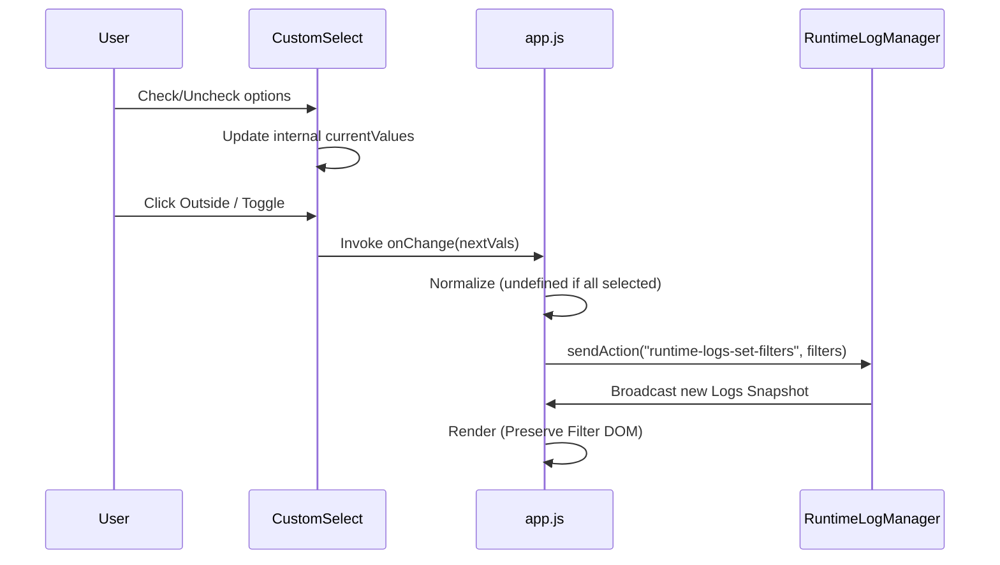

# Design: Refactor Runtime Log UI and Filter Interaction

## 1. Multi-Select Component Architecture
- **Internal State Management**:
    - The `createMultiSelect` helper maintains a local `currentValues` array.
    - Interaction involves a "Drafting" phase: users toggle checkboxes without immediate trigger of the `onChange` callback.
- **Lifecycle & Event Bubbling**:
    - **`closeMenuAndApply`**: A dedicated closure that handles menu collapse and final value broadcasting. It is invoked on:
        - Manual toggle (clicking the trigger when open).
        - Document "Outside Click" detection.
        - `Escape` key press.
    - **Document Click Listener**: A global listener is attached to the document. It queries all `.custom-select` elements and invokes their closure if the click target is outside the component boundary.
- **UI Logic**:
    - Dynamic trigger text calculation:
        - `0 selected`: Displays `placeholder` ("None").
        - `All Selected`: Displays `placeholder` ("All").
        - `1 selected`: Displays the specific option `label`.
        - `N selected`: Displays the selection count.

## 2. Advanced Filtering Logic & Data Flow
- **Value Mapping**:
    - The backend provided raw IDs (e.g., `skillrunner`, `workflow-foo`).
    - **`taskManagerDialog.ts`** was updated to pre-resolve these into `{ value: id, label: displayName }` pairs during snapshot generation.
- **Payload Normalization**:
    - To minimize redundant data in `sendAction`:
        - If the selection count equals the total options (All state), the filter is reset to `undefined`.
        - Otherwise, the explicit ID array is passed.

### Data Flow Diagram

## 3. Rendering Stability (Incremental DOM Strategy)
- **The Challenge**: The log dashboard updates every ~1s if logs are flowing. A full `innerHTML` or `replaceChildren` on the toolbar destroys active DOM state (like an open dropdown).
- **The Solution**: 
    - The toolbar is split into three functional zones:
        1. **`.logs-filter-wrap`**: Contains the multi-select inputs.
        2. **`.logs-action-wrap`**: Contains function buttons (Clear, diagnostic mode).
        3. **`.logs-context-wrap`**: Displays active filter badges.
    - During regular updates, the renderer checks for the existence of these wraps. It only replaces `.logs-action-wrap` and `.logs-context-wrap`.
    - **`.logs-filter-wrap`** is treated as a "Sticky" component. It is only rebuilt if the number of options (Backends/Workflows) changes or if it's the initial render.

## 4. Toast Notification System
- **Implementation**: A lightweight `showToast(message, type)` utility added to `app.js`.
- **Workflow**:
    - Action (e.g., Copy) -> Success -> `showToast()` -> Create DOM -> Slide In -> Auto-remove after 2.5s.
- **Styling**: Uses CSS transitions for smooth entry/exit without blocking user interaction in the log table.
