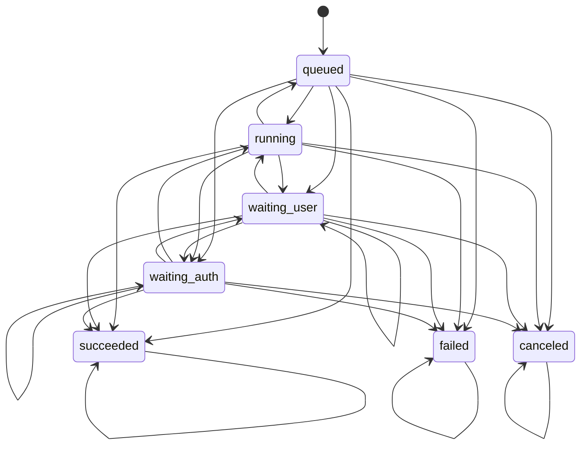
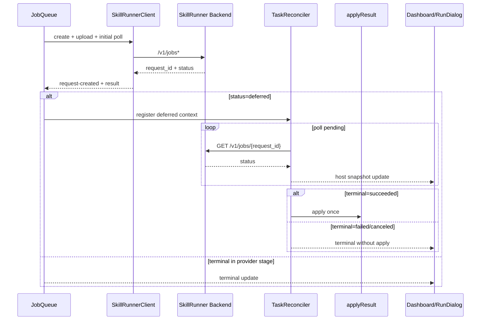

## Context

SkillRunner 后端状态机已经成为运行态 SSOT，但插件内部仍存在本地多处状态推断逻辑。为了降低未来漂移风险，需要在插件侧建立“消费后端状态机的统一内核”，并让所有执行链路共享同一套状态合同。

## Decisions

1. 新增统一状态机模块 `skillRunnerProviderStateMachine`
- 统一导出：
  - `normalizeStatus(raw)` / `normalizeStatusWithGuard(raw)`
  - `isTerminal(status)` / `isWaiting(status)`
  - `validateTransition(prev,next,ctx)`
  - `validateEventOrder(events,ctx)`
- 未知状态策略：
  - 归一化到安全非终态（默认 `running`）
  - 同步产出结构化 violation 供日志守护使用

2. 合法迁移与降级策略
- 定义显式迁移矩阵，覆盖：
  - `running -> waiting_* -> running -> terminal`
  - 轮询采样可能出现的压缩路径（如 `queued -> succeeded`）
- 迁移违规时：
  - 记录 `scope=state-machine` 诊断日志（包含 ruleId/prevState/nextState/requestId/action）
  - 降级为“保守状态”（保持当前非终态），不抛硬错误

3. 事件序不变量守护
- 关键事件：
  - `request-created`
  - `deferred`
  - `waiting-resumed`
  - `apply-succeeded`
- 规则：
  - deferred 之前必须出现 request-created
  - waiting-resumed 之前必须出现 waiting
  - apply-succeeded 至多一次
- 违规仅告警+降级，不中断任务

4. 全链路统一
- provider/client、queue、reconciler、apply 与 dashboard/run-dialog host 快照全部改用状态机模块。
- dashboard/run-dialog 前端脚本不再自行推断终态/等待态，改消费 host 下发语义字段（含 terminal/waiting）。

## Risks / Trade-offs

- 增加一层状态机抽象，短期改动面较大；通过合同测试与回归测试降低风险。
- 运行时采用“告警+降级”而非“抛错中断”，可能隐藏上游异常；通过结构化日志保证可观测性。

## State Machine

## Sequence

详细版本（含不变量与告警契约）见 `doc/components/skillrunner-provider-state-machine-ssot.md`。
